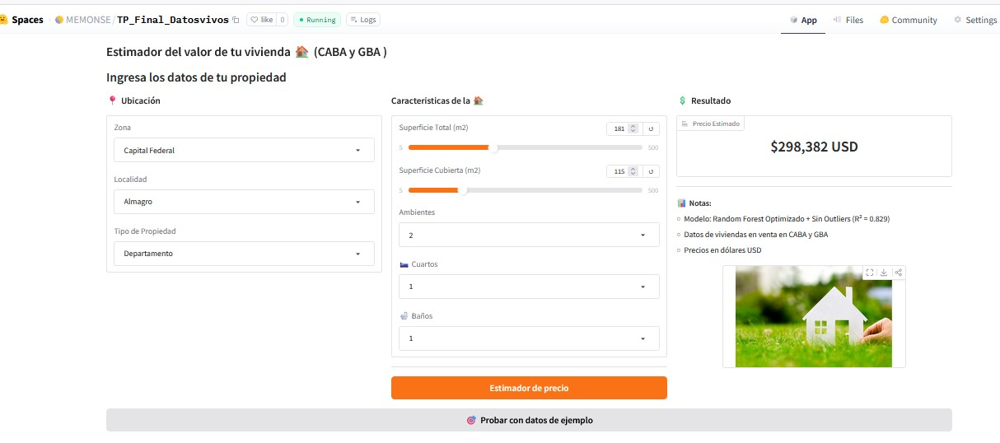

Check out the configuration reference at https://huggingface.co/docs/hub/spaces-config-reference


## Estimador de Precios de viviendas

# El link al Space de Hugging Face
[Abrir la aplicación en Hugging Face Spaces](https://huggingface.co/spaces/MEMONSE/TP_Final_Datosvivos)

# captura de pantalla de la aplicación en funcionamiento.




# Un ejemplo de uso del endpoint que proporciona Gradio una vez desplegado


## 🧠 Ejemplo de uso del endpoint API

Podés probar el modelo desde Python usando la API de Hugging Face Spaces:

```python
import requests

# URL del endpoint del modelo
url = "https://memonse-tp-final-datosvivos.hf.space/run/predict"

# Datos de entrada de ejemplo
input_data = {
    "rooms": 3,
    "bedrooms": 2,
    "bathrooms": 1,
    "surface_total": 65,
    "surface_covered": 55,
    "place_name": "Palermo",
    "property_type": "Departamento",
    "state_name": "Capital Federal"
}


response = requests.post(url, json=input_data)

print(response.json())
